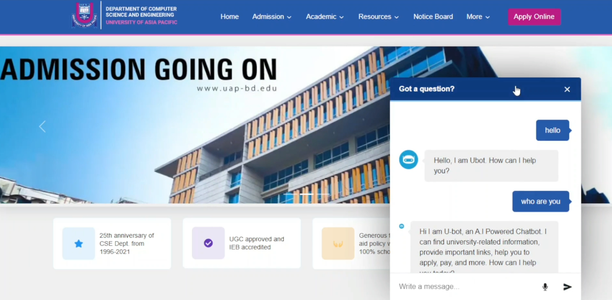

<p align="center">
    
</p>

<p align="center">

</a>

</p>

<br/>

# Introducing `Ubot`

<p align="center">
    
</p>

If an admitted student needs any information about our university, they do not know where to go or who to ask and do not get any immediate answers to these questions.

To solve this problem we developed a chatbot, where they can chat with an AI-powered bot that will provide all the information they need.

## Set up and run

1. Clone the repository

```bash
https://github.com/sportsman701/ubot-react.git
```

2. Change the working directory

```bash
cd ubot
```

3. Install dependencies

```bash
npm install # or, yarn install
```

4. Run the app in development mode

```bash
npm start # or, yarn start
```

That's All! Now open [localhost:3000](http://localhost:3000/) to see the app.

## Dependencies

```yaml
"dependencies":
{
    "bootstrap": "^5.1.3",
    "json-server": "^0.17.0",
    "next": "12.0.10",
    "react": "17.0.2",
    "react-bootstrap": "^2.1.2",
    "react-dom": "17.0.2",
    "react-icons": "^4.3.1",
    "react-linkify": "^1.0.0-alpha",
    "react-speech-recognition": "^3.9.0",
    "regenerator-runtime": "^0.13.9",
    "styled-components": "^5.3.3",
    "use-sound": "^4.0.1"
}

```

Looking for back-end build setup -> [`ubot-backend`](https://github.com/ingenuity-2-0/ubot_backend)

## License

This project is licensed under the MIT License - see the [`LICENSE`](LICENSE) file for details.
